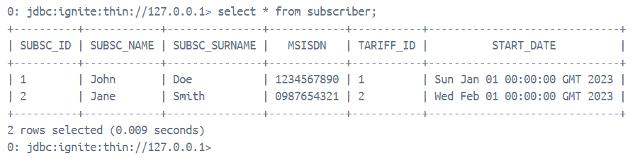
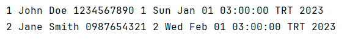

# Ignite Project

This project demonstrates how to connect to an Apache Ignite database using Java and JDBC. The project is configured to use Java 11, Apache Ignite 2.16.0, and Maven 3.9.8.

| Database  | Output |
|--------|------------|
|  |  |
